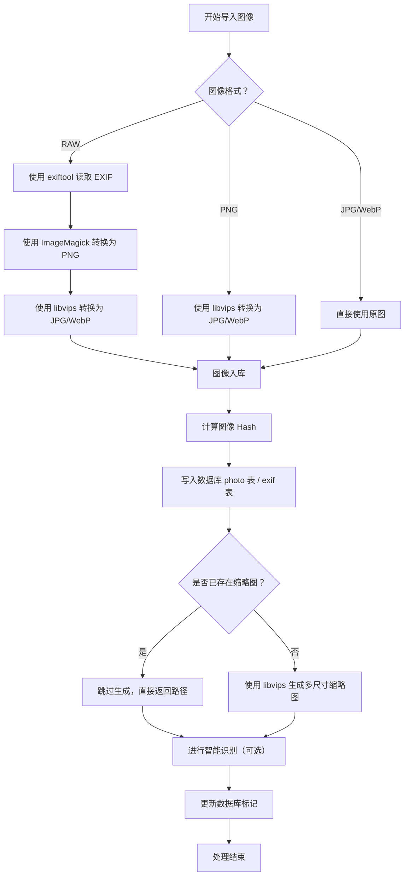

# Argus - 图像处理与管理系统

一个用Go语言开发的高性能图像处理与管理系统，支持多种图像格式处理、EXIF信息提取、缩略图生成等功能。

## 功能特性

- 🖼️ **多格式图像支持**: 支持 JPG、PNG、TIFF、BMP、GIF、HEIC/HEIF、WebP、AVIF、JXL等格式
- 📊 **EXIF信息提取**: 基于ExifTool的强大元数据提取功能
- 🎨 **高质量图像处理**: 集成ImageMagick和LibVips双重处理引擎
- 🚀 **高性能缩略图生成**: 可配置的缩略图格式和质量
- 🔄 **异步任务处理**: 基于协程的高并发图像处理
- 💾 **灵活的数据库支持**: 支持SQLite和MySQL数据库
- 🌐 **RESTful API**: 提供完整的HTTP API接口
- 📈 **性能监控**: 内置pprof性能分析工具

## 环境要求

### 运行环境
- **Go**: 1.24 或更高版本
- **操作系统**: Windows (x64)、Linux (x64)、macOS (x64/ARM64)

### 外部依赖工具
该项目依赖以下外部工具，需要在构建时正确配置：

1. **ExifTool** - EXIF信息提取
   - 版本要求: 13.30 或更高
   - 用途: 图像元数据提取和处理

2. **ImageMagick** - 图像处理
   - 版本要求: 7.1.1 或更高  
   - 配置: Portable Q16-HDRI版本
   - 用途: 图像格式转换、缩放、质量调整

3. **LibVips** - 高性能图像处理
   - 版本要求: 8.17.0 或更高
   - 用途: 高性能图像处理和缩略图生成

## 快速开始

> 目前项目处于开发阶段，依赖并不稳定，所以对于 imagemagick 与 libips 在 mac 端均需要使用
> homebrew 进行手动安装，其中 exiftool 的静态依赖以提供。
> 
> 未来版本会根据对应的依赖来完成静态依赖以及动态依赖的配置和安装。

### 1. 克隆项目

```bash
git clone <your-repo-url>
cd go-argus/src/rear
```

### 2. 安装Go依赖

```bash
go mod download
```

### 3. 准备工具链

项目使用自动工具链管理系统。在开发环境下，程序会自动从 `tools/` 目录解压所需的工具：

开发环境依赖安装（macOS）

本项目需要依赖 Homebrew、ImageMagick 和 libvips。以下步骤介绍如何在 macOS 上安装这些工具。

1. 安装 Homebrew

Homebrew 是 macOS 的包管理工具，可以方便地安装和管理各种依赖。
在终端中执行以下命令安装 Homebrew：

/bin/bash -c "$(curl -fsSL https://raw.githubusercontent.com/Homebrew/install/HEAD/install.sh)"


安装完成后，执行以下命令确认 Homebrew 是否安装成功：

brew --version


输出类似以下结果，表示安装成功：

Homebrew 4.x.x

2. 安装 ImageMagick

安装 Homebrew 之后，可以使用它安装 ImageMagick：

brew install imagemagick


验证安装是否成功：

magick -version


如果看到类似以下输出，表示安装成功：

Version: ImageMagick 7.x.x

3. 安装 libvips

同样使用 Homebrew 安装 libvips：

brew install vips


验证安装是否成功：

vips --version


输出类似以下结果，表示安装成功：

vips-8.x.x

4. 注意事项

如果在安装过程中遇到网络问题（例如下载依赖失败），可以配置代理

避免同时使用多个 homebrew 会出现锁竞争


#### 目录结构说明
```
tools/
├── windows_amd64/          # Windows 64位工具
│   ├── exiftool/
│   │   └── exiftool-13.30_64.zip
│   ├── imagemagick/
│   │   └── ImageMagick-7.1.1-47-portable-Q16-HDRI-x64.zip
│   └── libvips/
│       └── vips-dev-w64-all-8.17.0.zip
├── linux_amd64/           # Linux 64位工具 (待添加)
└── darwin_amd64/          # macOS 64位工具 (待添加)
    └── darwin_arm64/      # macOS ARM64工具 (待添加)
```

#### Windows用户 (已提供)
工具包已包含在项目中，首次运行时会自动解压到应用目录。

#### Linux/macOS用户 (需要手动准备)
请下载对应平台的工具包并按以下结构放置：

**Linux x64:**
```bash
# 创建目录
mkdir -p tools/linux_amd64/{exiftool,imagemagick,libvips}

# 下载并放置工具包
# ExifTool
wget -O tools/linux_amd64/exiftool/exiftool-13.30.tar.gz https://exiftool.org/Image-ExifTool-13.30.tar.gz

# ImageMagick (示例)
# 请根据官方文档下载适合的Linux版本

# LibVips (示例)  
# 请根据官方文档下载适合的Linux版本
```

**macOS:**
```bash
# 创建目录
mkdir -p tools/darwin_amd64/{exiftool,imagemagick,libvips}
mkdir -p tools/darwin_arm64/{exiftool,imagemagick,libvips}

# 使用Homebrew安装或手动下载对应工具包
```

### 4. 配置文件

复制配置文件并根据需要修改：

```bash
cp config.yaml.example config.yaml
```

主要配置项：
- `app.port`: 服务端口 (默认: 8080)
- `app.mode`: 运行模式 debug/release (默认: debug)
- `app.development`: 开发模式开关 (默认: true)
- `database.type`: 数据库类型 sqlite/mysql (默认: sqlite)
- `image.thumbnail_format`: 缩略图格式 (默认: jpg)

### 5. 运行应用

#### 开发模式
```bash
go run main.go
```

#### 编译后运行
```bash
go build -o rear.exe .
./rear.exe
```

应用启动后，访问 `http://localhost:8080` 即可使用API。

### 6. 验证安装

应用启动时会显示工具版本信息，确认所有工具都正确检测：

```
=== 工具信息 ===
ImageMagick : Version: ImageMagick 7.1.1-47 Q16-HDRI x64
ExifTool    : ExifTool 13.30
LibVips     : vips-8.17.0
================
```

## 构建部署

### 本地构建

```bash
# 构建当前平台
go build -o rear .

# 跨平台构建示例
# Windows
GOOS=windows GOARCH=amd64 go build -o rear.exe .

# Linux
GOOS=linux GOARCH=amd64 go build -o rear .

# macOS
GOOS=darwin GOARCH=amd64 go build -o rear .
GOOS=darwin GOARCH=arm64 go build -o rear .
```

### 使用构建脚本

项目提供了自动化构建脚本：

```bash
chmod +x scripts/build.sh
./scripts/build.sh
```

该脚本会：
1. 构建多平台可执行文件
2. 复制对应平台的工具链
3. 创建发布包

### 生产部署

1. **准备运行环境**
   - 确保目标机器有对应平台的工具链文件
   - 配置合适的 `config.yaml`
   - 设置 `app.development: false` 启用生产模式

2. **部署步骤**
   ```bash
   # 1. 上传可执行文件和配置
   scp rear config.yaml target-server:/opt/argus/
   
   # 2. 上传工具链 (如果需要)
   scp -r tools/ target-server:/opt/argus/
   
   # 3. 启动服务
   ssh target-server "cd /opt/argus && ./rear"
   ```

3. **系统服务配置** (Linux)
   ```ini
   # /etc/systemd/system/argus.service
   [Unit]
   Description=Argus Image Processing Service
   After=network.target
   
   [Service]
   Type=simple
   User=argus
   WorkingDirectory=/opt/argus
   ExecStart=/opt/argus/rear
   Restart=always
   RestartSec=10
   
   [Install]
   WantedBy=multi-user.target
   ```

## API文档

### 基础接口

- `GET /api/health` - 健康检查
- `GET /api/version` - 版本信息

### 图像处理接口

- `POST /api/images/upload` - 上传图像
- `GET /api/images/{id}` - 获取图像信息
- `GET /api/images/{id}/thumbnail` - 获取缩略图
- `GET /api/images/{id}/exif` - 获取EXIF信息

详细API文档请查看项目的API文档或通过接口探索。

## 开发指南

### 项目结构

```
.
├── main.go                 # 应用入口
├── config.yaml.example     # 配置文件模板
├── internal/              # 内部包
│   ├── api/              # API处理器
│   ├── config/           # 配置管理
│   ├── container/        # 依赖注入容器
│   ├── db/              # 数据库操作
│   ├── handler/         # 业务处理器
│   ├── model/           # 数据模型
│   ├── repositories/    # 数据仓库
│   ├── router/          # 路由配置
│   ├── service/         # 业务服务
│   ├── utils/           # 工具函数
│   └── workflow/        # 工作流
├── pkg/                 # 公共包
│   ├── img_utils/       # 图像工具
│   ├── logger/          # 日志工具  
│   └── utils/           # 通用工具
├── tools/               # 外部工具链
└── scripts/             # 构建脚本
```

### 运行测试

```bash
# 运行所有测试
go test ./...

# 运行特定包的测试
go test ./internal/utils -v

# 运行性能测试
go test -bench=. ./...
```

### 性能分析

开发模式下，应用会启用pprof性能分析：

```bash
# CPU性能分析
go tool pprof http://localhost:8080/debug/pprof/profile

# 内存分析  
go tool pprof http://localhost:8080/debug/pprof/heap

# 协程分析
go tool pprof http://localhost:8080/debug/pprof/goroutine
```

## 故障排除

### 常见问题

1. **工具未找到错误**
   ```
   Error: ImageMagick not found
   ```
   - 检查 `tools/` 目录下是否有对应平台的工具包
   - 确认工具包文件名正确
   - 在开发模式下确保 `app.development: true`

2. **权限错误** (Linux/macOS)
   ```
   permission denied
   ```
   - 给可执行文件添加执行权限: `chmod +x rear`
   - 检查工具链文件权限

3. **端口占用**
   ```
   bind: address already in use
   ```
   - 修改 `config.yaml` 中的端口配置
   - 或终止占用端口的进程

4. **数据库连接失败**
   - 检查数据库配置
   - 确认数据库文件路径权限 (SQLite)
   - 检查MySQL连接参数 (MySQL)

### 日志查看

应用日志保存在 `app-logs/` 目录下：

```bash
# 查看应用日志
tail -f app-logs/app.log

# 查看错误日志
grep "ERROR" app-logs/app.log
```

### 调试模式

设置环境变量启用详细日志：

```bash
# 设置日志级别为debug
export LOG_LEVEL=debug
./rear
```

## 图像处理与存储设计方案

本图像管理软件旨在高效、安全、结构化地处理和管理本地图片。下列内容描述了图像格式支持、数据表结构、处理逻辑、缩略图策略、重复图判断、EXIF 信息提取、GIF/视频支持等核心模块。

---

### 支持格式与格式转换策略

软件仅支持 `JPG` 与 `WebP` 作为基础展示格式。其他图像或视频格式将自动转换为这两种格式，以获得更好的浏览器兼容性与性能。

#### 格式处理规则：

- **RAW 图像**：
  - 使用 `exiftool` 读取 EXIF 信息；
  - 使用 `ImageMagick` 转换为 `PNG`（以保留最高画质）；
  - 再由 `libvips` 转换为 `JPG` 或 `WebP`。

- **PNG 图像**：
  - 使用 `libvips` 转换为 `JPG` 或 `WebP`；
  - 转换完成后删除临时 PNG 文件。

- **JPG/WebP 图像**：
  - 若为原始文件，直接进入缩略图生成流程；
  - 若由 PNG 转换而来，则在缩略图目录生成一份“原图副本”供未来访问。

- **GIF 图像**：
  - 拆分为“封面图 + 视频 (MP4)”进行存储；
  - 浏览器中预览封面，点击后播放视频。

- **视频（MP4、AVI、MKV 等）**：
  - 使用 `ffmpeg` 统一转码为 `MP4(H.264)`；
  - 同时生成封面图用于展示。

- **LivePhoto / MotionPhoto**：
  - 处理方式与 GIF 类似，提取图片和视频部分，分离存储；
  - 当前仅支持 LivePhoto，未来计划支持 MotionPhoto。

---

### 数据库存储结构

#### `photos` 表（图像主信息表）

| 字段名            | 说明                   |
|-------------------|------------------------|
| `hash`            | 图像 SHA-256 值，作为主键 |
| `width`           | 图像宽度               |
| `height`          | 图像高度               |
| `format`          | 原始格式（jpg/webp）   |
| `file_size`       | 文件大小（字节）        |
| `file_path`       | 原始文件路径            |
| `created_at`      | 创建时间               |
| `updated_at`      | 更新时间               |
| `has_face`        | 是否检测到人脸         |
| `has_object`      | 是否检测到物体         |
| `has_scene`       | 是否检测到场景         |
| `has_text`        | 是否检测到文字         |
| `accessed_at`     | 最近访问时间           |
| `access_count`    | 累计访问次数           |

#### `photo_exif` 表（EXIF 信息表）

- 如果没有对应数据，说明图像尚未进行 EXIF 提取。

| 字段名              | 说明                |
|---------------------|---------------------|
| `hash`              | 对应图像哈希         |
| `width`             | 图像宽度            |
| `height`            | 图像高度            |
| `format`            | 原始格式            |
| `file_size`         | 文件大小            |
| `created_at`        | 创建时间            |
| `updated_at`        | 更新时间            |
| `make`              | 相机厂商            |
| `model`             | 相机型号            |
| `exposure_time`     | 曝光时间            |
| `f_number`          | 光圈                |
| `iso_speed_ratings` | ISO 感光度          |
| `focal_length`      | 焦距                |
| `datetime_original` | 拍摄时间            |
| `gps_latitude`      | 纬度                |
| `gps_longitude`     | 经度                |

---

### 原图获取逻辑

- 若原图为 JPG 或 WebP，直接返回原路径；
- 若原图来源为 PNG/RAW 转换：
  - 检查 `缩略图目录` 是否存在“原图副本”；
  - 若存在，返回其路径；
  - 若不存在，自动生成副本后返回路径。

---

### 缩略图生成与存储

#### 缩略图生成流程：

1. 所有图像最终转换为 JPG 或 WebP；
2. 使用 `libvips` 根据尺寸生成缩略图；
3. Hash 用于构建路径，避免单目录内文件过多。

#### 缩略图路径结构：

```

/app/temp/thumbnail/{h1}{h2}/{h3}{h4}/{hash剩余部分}/{size}.jpg

```

**示例：**

假设图像 Hash 为 `12903jowi3ej49rq2r834ru3q49itj`，则缩略图路径为：

```

/app/temp/thumbnail/12/90/3jowi3ej49rq2r834ru3q49itj/original.jpg
/app/temp/thumbnail/12/90/3jowi3ej49rq2r834ru3q49itj/300X300.jpg
/app/temp/thumbnail/12/90/3jowi3ej49rq2r834ru3q49itj/500X500.jpg

```

4. 若目标缩略图已存在，则直接返回路径；
5. 若不存在，则自动生成后返回。

---

### 缩略图裁剪与压缩策略

- 默认按原始比例等比压缩；
- 对于比例极端的图片（如长截图、全景图）：
  - 默认最小宽度为 `300px`，最长边不超过 `1:10`；
  - 中心裁剪为 `300x600` 或其它合理尺寸；
  - 例：原图 `1000x100`，裁剪为 `300x600`（中间区域）；
- 若原图本身较小（如 `300x300`），则不裁剪，直接使用原图。

---

### EXIF 信息提取逻辑

1. 获取图像的 SHA-256 Hash；
2. 查询数据库：
   - 若已存在 EXIF 数据，则直接返回；
   - 若不存在，则使用 `exiftool` 读取并存储。

---

### 重复图片处理机制

- 每张图片以 Hash（SHA-256）作为唯一标识；
- 若系统中已存在相同 Hash 的图像：
  - 添加记录至 `duplicate_images` 表，保存路径；
  - 图像预览界面不显示重复图像，仅在“文件夹视图”中展示全部图像。

---

### GIF 与视频支持

#### GIF

- 拆分为“封面图 + 视频文件”结构；
- 浏览器中显示封面图，点击播放视频；
- 视频统一为 MP4 格式，使用 `ffmpeg` 转换。

#### 视频

- 支持格式：MP4、AVI、MKV 等；
- 全部统一转换为 `MP4(H.264)` 格式；
- 同时生成封面图，用于前端快速预览。

---

### LivePhoto 与 MotionPhoto

- 当前支持 Apple 的 LivePhoto；
- 拆解图片 + 视频部分，按 GIF 处理逻辑处理；
- 未来支持 Android 的 MotionPhoto。

---

### 新图像批量处理流程

1. 使用协程进行并发处理，处理流程如下：
   - 获取文件 Hash；
   - 判断原图与缩略图是否存在；
   - 若不存在，则生成；
   - 图像立即可展示于 Web 前端。

2. 异步调用 Python API 进行智能分析：
   - 人脸识别
   - 场景识别
   - 物体识别
   - OCR 文字识别

3. 识别结果写入数据库，并同步状态。

4. **并发限制策略**：
   - 并发数 = `min(可用内存, CPU核心数)`；
   - 若内存不足，则暂停新任务；
   - 若 CPU 紧张，则减慢并发速率。

---

### 示例原始路径与处理流程

- 原始 RAW 图路径：  
  `/user/photo/2020-1-1/camera/202001011011.raw`

- PNG 临时路径（若不存在则生成）：  
  `/app/temp/png-tmp/202001011011.png`

- 缩略图路径结构（假设 Hash 为 `12903jowi3ej49rq2r834ru3q49itj`）：  

```

/app/temp/thumbnail/12/90/3jowi3ej49rq2r834ru3q49itj/original.jpg
/app/temp/thumbnail/12/90/3jowi3ej49rq2r834ru3q49itj/300X300.jpg

```

---

## 未来规划（可选模块）

- 图像标签管理与备注功能
- 图像来源标记（导入、自同步、扫码等）
- 任务状态表（支持失败重试、日志记录）
- 图像相似度分析（非哈希完全一致）
- 图像分享与链接生成模块（带水印/权限）

---


